# Your Data In The Spotlight With Microsoft Power BI

###### In an era where data drives decisions, the importance of representing data in a meaningful, compelling, and easily digestible manner can’t be overemphasized. This is where Microsoft's Power BI enters the stage, shining a spotlight on your data and transforming it into actionable insights.

In this article, we will learn about Power BI and use data to build an information-rich report:

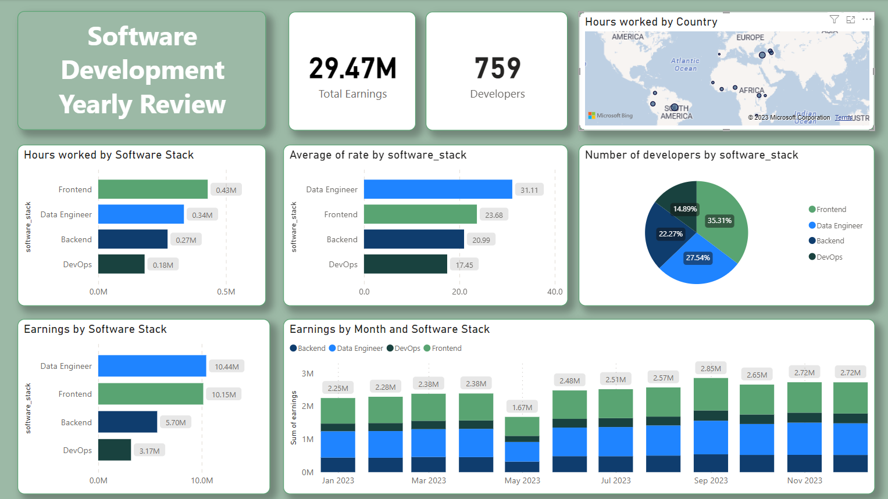

## What is Microsoft Power BI used for?

Microsoft Power BI is a data visualization and business intelligence tool. It pulls data from various sources, processes it, and turns it into interactive dashboards and reports. This means you can connect Power BI to databases, spreadsheets, cloud services, and more, then visualize and analyze that data in one place. It offers powerful data modeling capabilities and real-time analytics. In essence, Power BI helps individuals and organizations see and understand their data more effectively, aiding in informed decision-making.

One of the distinct advantages of Power BI over its competitors is its deep integration with other Microsoft products, especially Excel. For countless professionals worldwide, Excel has been the go-to tool for handling and analyzing data for decades. Power BI leverages this familiarity by offering a user interface that echoes the look and feel of Microsoft Office products. If you're already accustomed to the ribbon layout of Excel, diving into Power BI feels more like a smooth transition than a steep learning curve. This familiar design ethos reduces the intimidation factor that often accompanies new software, making it more accessible to users of all expertise levels.

However, the allure of Power BI isn’t solely in its familiar UI. The tool stands tall on its merits compared to other data visualization platforms. Its ability to connect to a wide array of data sources, both on-premises and in the cloud, makes it versatile and fit for various business needs. Additionally, its robustness in handling large datasets without compromising performance sets it apart in the industry.

In addition to being a crucial tool for product managers and product owners, Microsoft Power BI holds great value for developers as well. The ability to derive insights from data is a skill set that transcends roles and empowers every team member in an organization. For example, a team of developers can benefit from Power BI in the following manners: explore and analyze large datasets (especially when dealing with logs), visualize performance metrics of the application and servers, investigate how a database is being used, and build machine learning models.

## Power BI's Pricing Model

Microsoft offers different pricing tiers for Power BI, catering to various needs and budgets. At the most basic level, there's **Power BI Desktop**, which is entirely free to use. This standalone software allows users to create reports, visualize data, and perform basic data analytics. It's perfect for individuals or small teams exploring data visualization without a hefty price tag.

Then there's **Power BI Pro**, a paid version that provides more advanced collaboration features, enabling users to publish, share, and collaborate on reports and dashboards within their organization. With the Pro version, more extensive data capacities, additional sharing options, and premium content packs from services like Salesforce and Dynamics 365 become accessible.

Lastly, there's **Power BI Premium** for larger enterprises or businesses requiring even more extensive capabilities. This tier provides dedicated cloud resources, greater storage and data refresh rates, and advanced AI-driven data analytics capabilities.

The choice between the free and paid versions ultimately depends on the user's needs: while the free Desktop version provides a solid foundation, businesses aiming for collaboration, larger data handling, or deeper analytics will find the paid tiers more apt for their requirements.

Summing up, with the free version of Power BI Desktop, you're mainly getting a tool for creating and viewing reports on your own machine. Direct sharing of reports (like publishing to the web or sharing with other users) is a feature of the Power BI Service, and more specifically, it requires a Power BI Pro or Premium license. However, if you're using the free Power BI Desktop and want to share your work with someone else, here are some methods:

* PBIX Files: You can share the .pbix file you create in Power BI Desktop. The recipient would also need Power BI Desktop installed on their machine to open and view the report. As a security concern, bear in mind that sharing a .pbix file exposes your raw data.
* Export as PDF: Power BI Desktop allows you to export your reports to a PDF format. This won't give the recipient the interactivity of a live Power BI report, but it's useful for presentations or static data views. If the generated PDF file gets cut off, try zooming out before exporting.
* Screenshots or Screen Recordings: A more rudimentary method would be to take screenshots or create screen recordings of your report. This approach loses interactivity but can be helpful for quick sharing or if the other party just needs a visual snapshot.

## Getting Started with Power BI Desktop

For the rest of this article, we will use mocked data that represents the billable hours for a remote software development company. Although this example concerns an object of study that would usually be conducted by a _business intelligence_ or _data analysis _team, the concepts and tools we will explore can be adapted and used, for example, in the software development lifecycle.

You can [download](https://apps.microsoft.com/detail/power-bi-desktop/9NTXR16HNW1T?hl=en-us&gl=US) Power BI Desktop from the Microsoft Store on Windows. Once installed, open the application. You'll be greeted with a start screen with resources such as guided learning videos and recent files. Feel free to explore, or close this screen to follow along with our tutorial.

The data is presented as a CSV file, consisting of roughly 9000 individual records with the following columns: developer name, country of residence, hourly rate, month, hours worked in that particular month, and software stack. You can download the sample data [from here](https://github.com/jeromevonk/power_bi_samples/tree/main/your_data_in_the_spotlight/data) to reproduce the steps in the article.

To start, click _Get Data > Text/CSV_ and choose the ‘developer_records.csv’ file.

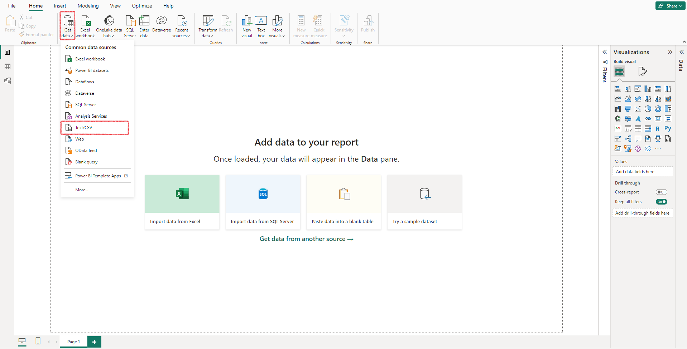

After the application processes the data, you will be presented with a preview. There’s a very tempting ‘Load’ button highlighted in green to accept the data as it is, but it’s strongly recommended to click on ‘**Transform Data**’ instead because, more often than not, you will need to make adjustments. It’s precisely the case for this example, as you can see from the preview:

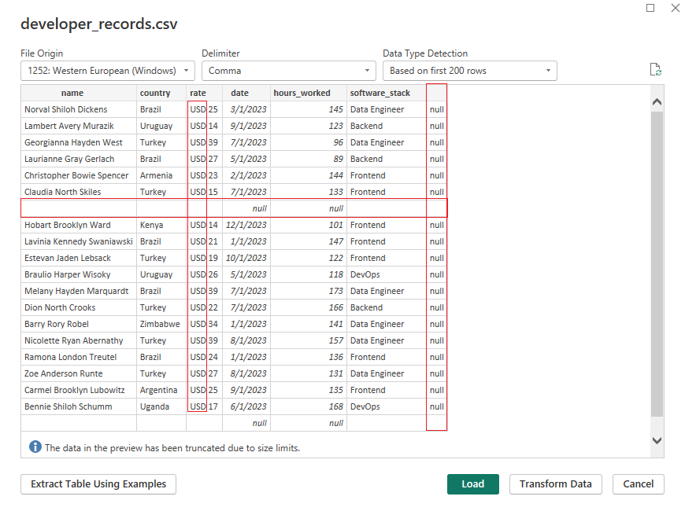

In this step, you can use the Power Query Editor, which provides a wide range of data transformation and cleaning capabilities, such as removing duplicates, renaming columns, fixing typos, transforming date and time, converting text to the proper case, and creating new columns. It is a good practice to clean the data before analyzing it, and this is the appropriate step to do it.

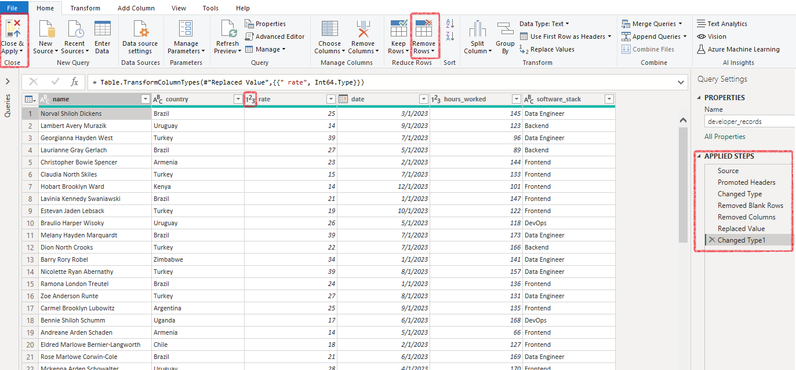

On the right side of the screen, the **Applied Steps** panel shows the transformations applied to the data:

* The first three steps were automatically added by Power BI:
  * _Source_: path to the CSV file, choosing delimiters
  * _Promoted Headers_: use the first row of data as column headers
  * _Changed Type_: two column types were changed. Column **‘date’** was identified as ‘date’ and ‘**hours_worked’** was identified as ‘number’
* The last four steps were done manually:
  * _Removed Blank Rows_ by clicking on _Home > Remove Rows > Remove Blank Rows_;
  * _Removed _the empty column with ‘null’ data by right-clicking the column and choosing _Remove_;
  * Deleted the ‘USD’ prefix on the **‘rate’** column by right-clicking the column name and then clicking _Replace Values_. When the pop-up appears, input “USD “ (with a trailing space) on the “_Value to Find_” field and leave the “_Replace With_” field empty.
  * Changed ‘**rate’** column data type to ‘number’;

There is no ‘Undo’ functionality in this editor (CTRL+Z won’t work), but if you did something wrong by accident, find the step on **Applied Steps** panel and remove it by clicking the ‘X’ that’s placed just to the left.

After inspecting the data, click **Close & Apply** on the **Home** tab to close the Power Query Editor. If you need to access it anytime later, click ‘Transform Data’ on the home tab of the ribbon.

##

## Enriching the dataset

At this point, you will see an empty _Report View_. Before adding visualizations to our report, we can benefit from creating a new column, **‘earnings’**, calculated as the product of a developer’s work rate and the hours worked during a particular month.

To achieve this, enter the Table View, right-click anywhere inside the table, and click _New column_. The syntax to define the column's value differs from what you might be accustomed to if you are familiar with spreadsheets. You will create an expression that will be applied to the whole column (as opposed to applying it to every cell). In this example, we need to multiply two columns. This is the expression we need:

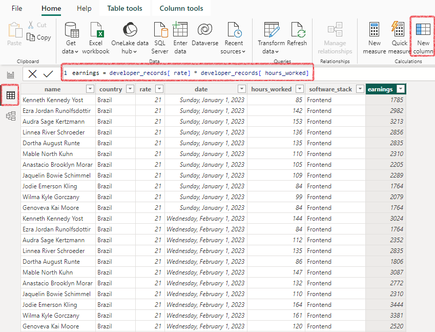

## Creating a Report

Looking at the "Visualizations" pane on the right in the _Report View_,  you'll see icons representing different visualizations: column chart, line chart, pie chart, map, table, etc. Click on one of these icons to create a new visualization of that type on your report canvas.

With the new visualization selected, use the "Data" pane on the right to drag and drop fields from your data source into the visualization’s data parameters. Depending on the visualization type, there might be areas labeled as "Values", "Axis", "Legend", "Category", "Tooltips", etc.

After configuring it, you can change the visualization type by clicking a different icon. This is the source of a common mistake for beginners. After you’re done with a visual and ready to create another one, many users will click directly into another icon, which will edit the currently selected one. You can undo (CTRL+Z) the action, click on a blank space in the canvas to deselect the visualization, and then create the next one.

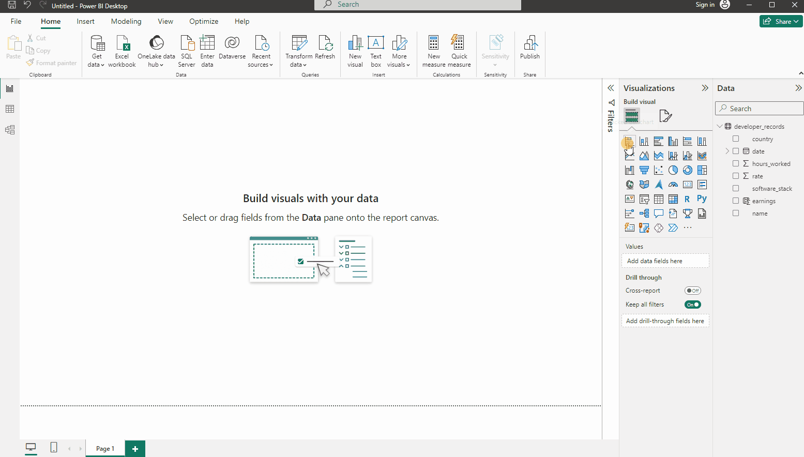

To create a report for this article, one Text Box (for the title) and nine visualizations were added:

The **Card** visualization type was used to showcase the _Total Earnings_ and the number of _Developers_. To add data to a **Card**, select the visualization and drag a measure into the “Fields” area.

For the first card, select the _earnings _measure created in the last section. Power BI will likely understand you want to display the **sum** of the earnings. If not, you can easily change it by clicking the dropdown.

For the second card, select the _developer_name _measure. Power BI will not know your intentions here, so it will probably show the name of the first developer. Change it to **Count (Distinct)** to get the number of developers that reported work at least once in the year.

By default, the card will show the measure name as the title, which might not be what you intend. You can rename it by clicking **Rename for this visual** inside the dropdown.

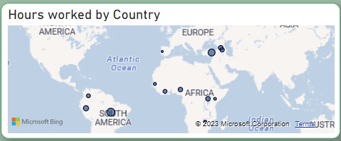

A **Map** visualization was used to show how remote work is geographically distributed around the globe. The important inputs in this case are **Location** (use the _country _measure) and **Bubble size** (use _Sum of hours_worked_). Optionally, you can add tooltips (sum of earnings, count of distinct developer_name) that will appear when the mouse is over a location.

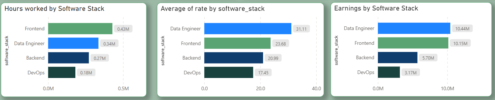

Three **Stacked bar charts** were created to analyze how much each software stack is being used and generating earnings. In all cases, _software_stack_ is the selected measure for the **Y-axis.** For the **X-axis**, the measures in the respective order are _Sum of hours_worked_, _Average of rate_, and _Sum of earnings_.

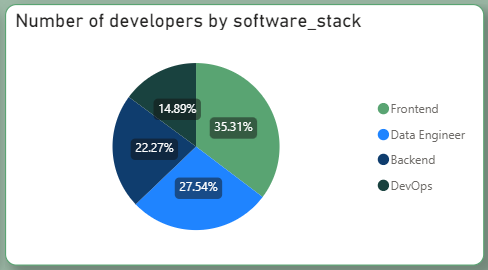

The **Pie Chart** comes in handy to visualize percentages. It becomes easy to interpret the proportion of developers working on each stack. This can be achieved by selecting the _software_stack_ measure on the **Legend** area and _Count (Distinct) of developer_name _as **values**.

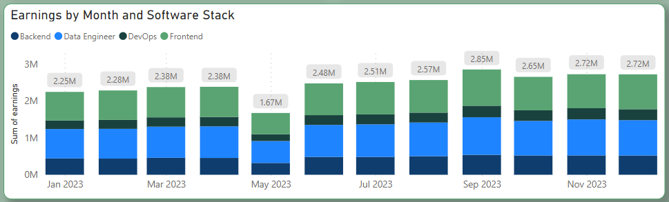

Finally, a **Stacked column chart** shows the earnings by month, faceted by software stack.

To achieve this, select the _date _measure for the **X-axis**, _Sum of earnings_ for the **Y-axis**, and _software_stack_ for **Legend**.

### Formatting and appearance

Power BI allows users to customize the appearance of visualizations with precision and flexibility. Users can adjust a wide range of visual elements, such as colors, fonts, data labels, and shapes. This empowers users to match the visual style of their reports to their organization's branding or personal preferences, enhancing the overall impact and clarity of their data presentations.

To customize appearance, the first step is to choose a theme on the **View** ribbon. After that, you can choose different colors for your visuals. If you look at it closely, you’ll realize that the colors are consistent through different visualizations. Whenever a software stack is referenced, it always has the same color, for example. Also, every visualization has a rounded border and a shadow to make it more appealing.

A tip that can save you a lot of time when customizing is to first format one visualization and apply the same style to other visuals using the **Format Painter** button (a feature that also exists in other Microsoft Apps like Word and Excel).

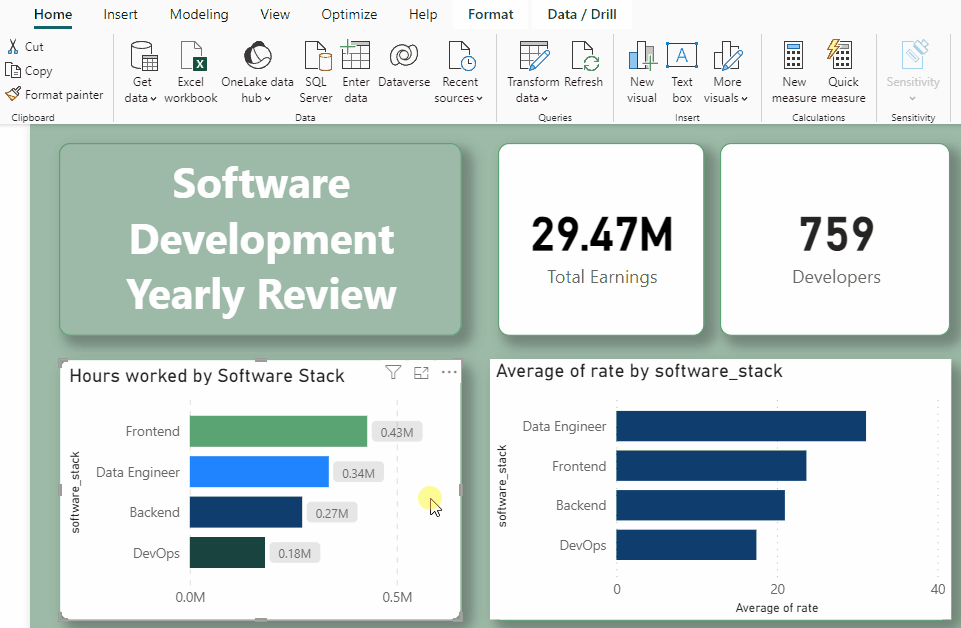

## Insights

Now that the report has been created, it's time to extract valuable insights from it. This is the essence of business intelligence – deciphering the messages hidden within the data.

### Which software stack is contributing the most to the earnings?

Looking at the Pie chart, we can clearly see that _Frontend_ is the most used software stack (35.3%) by developers of this particular company. Correlated to this, we can see that _Frontend_ is the stack with the most billed hours during the year.

However, despite its popularity, it is not the stack with the highest earnings this year. This is explained by the average rate per hour of _Data engineering_ professionals being roughly 31% bigger than _Frontend_ developers.

For a company looking to extend profits, a possible next step would be to investigate if this is a long-lasting trend and, if it is aligned with the company’s purpose, invest time and effort to train engineers in this stack while simultaneously seeking new market opportunities.

### What happened in May?

The Earnings per Month visualization indicates a general upward trend in earnings throughout the year, except for notable exceptions in May and September. May witnessed a significant decline, while September marked a substantial increase.

The anomaly in May prompts us to investigate further. All software stacks experienced similar downfalls, ruling out the possibility of a specific stack falling out of demand that month. Moreover, average rates remained stable during May. The key factor contributing to the decrease in earnings appears to be a reduction in working hours.

In this case, the data in the report alone will not be enough to understand what happened. A broader analysis will have to take place. Some potential considerations include: Did an unusually high number of employees take leave during May? Were there any significant global events during this period that could have impacted demand? Is it plausible that demand diminished due to specific, identifiable factors?

## Conclusion

For businesses and individuals alike, navigating the realm of data analytics and visualization can sometimes feel like walking in a maze. However, Power BI offers clarity, allowing users to unearth the hidden story within their data. Whether you're a seasoned analyst or just starting out in the world of data, Power BI's combination of power, flexibility, and familiarity makes it an essential tool in data-driven decision-making.

## Resources

* Microsoft’s Power BI [overview](https://powerbi.microsoft.com/what-is-power-bi/) and [pricing](https://powerbi.microsoft.com/pricing/)
* [Data](https://github.com/jeromevonk/power_bi_samples/tree/main/your_data_in_the_spotlight/data) analyzed in this article
* [Source code](https://github.com/jeromevonk/power_bi_samples/tree/main/your_data_in_the_spotlight/src) to create the mocked data
* Report [exported to PDF](https://github.com/jeromevonk/power_bi_samples/blob/9d6f6a8cf4025434cf5083b3d6f01b91d5d0d9a0/your_data_in_the_spotlight/assets/article_your_data_spotlight.pdf)
* [Power BI file](https://github.com/jeromevonk/power_bi_samples/tree/main/your_data_in_the_spotlight/power%20bi) to run locally
* [Animated GIF](https://github.com/jeromevonk/power_bi_samples/blob/9d6f6a8cf4025434cf5083b3d6f01b91d5d0d9a0/your_data_in_the_spotlight/assets/presentation.gif) with dynamic report
